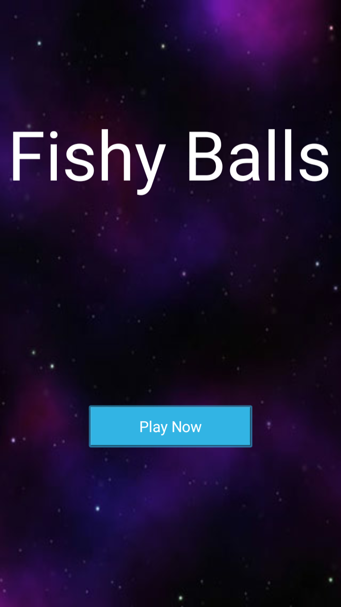
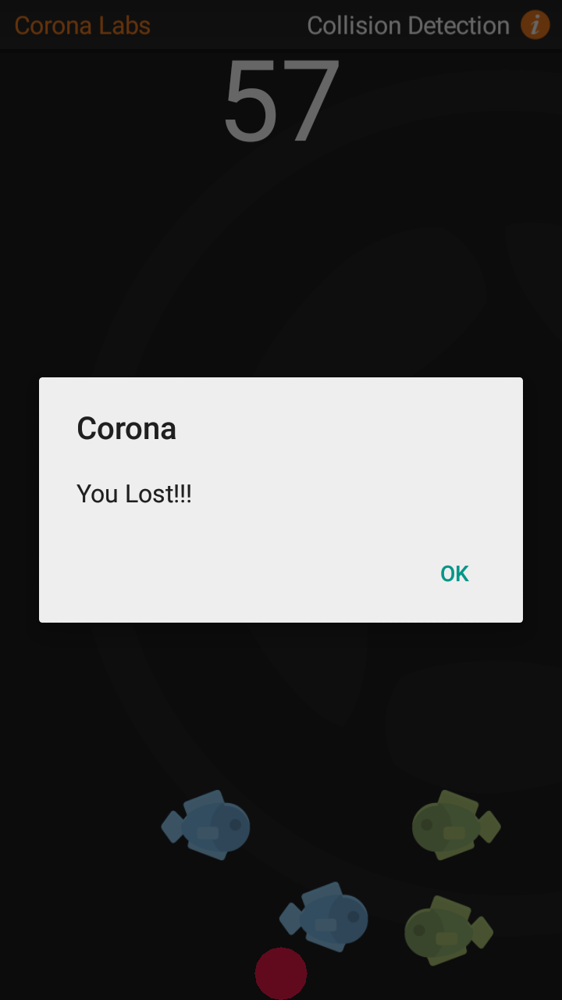
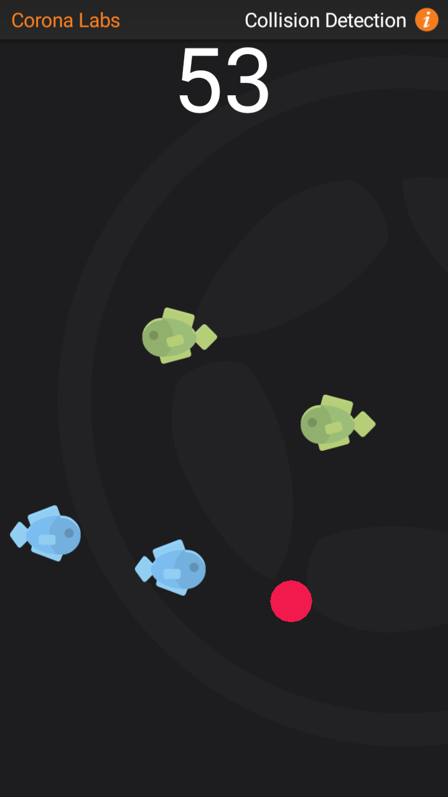

## Fishy Balls

The Touch based game I developed using corona-sdk in lua follwing their examples. The user need to keep moving the red ball by
dragging it using finger touch for 60 seconds to win.

- The Apk file can be found here at [fishy_balls_apk](./Final_APP)

### Screenshots :

